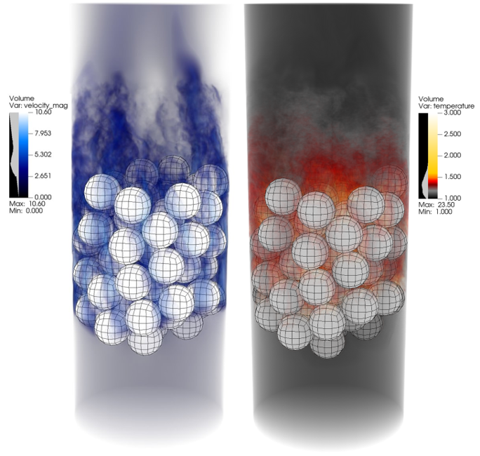

---------------------
Test Bed- 67 Pebble
---------------------

In this tutorial we are going to set up and simulate a simple conjugate heat transfer (CHT) case using a helium (Pr=0.71) cooled 67-pebble bed. 
This case will couple NekRS and MOOSE's CHT module using CARDINAL as a wrapper. More information about the NEAMS tool CARDINAL can be found on `github <https://github.com/neams-th-coe/cardinal>`_, or on their website `here <https://cardinal.cels.anl.gov/>`_.
In each time step MOOSE will solve the energy equation in the the solid subdomain and pass the solution to NekRS,
which will in-turn solve both the Navier-Stokes and energy equations in the fluid subdomain. 
NekRS will then pass its temperature solve back to MOOSE in the next time step. This transfer of information occurs 
at the boundary between solid and fluid subdomains, which are the pebble surfaces in this case. 
This model is based on an unpublished experiment from Texas A&M.

Before starting this tutorial it is recommended to complete the tutorials on the CARDINAL website, specifically the CHT examples `here <https://cardinal.cels.anl.gov/tutorials/cht.html>`_.

..........................
Pre-processing
..........................

When setting up a test case in NekRS/CARDINAL, case files will often need to be edited. This simulation will require both NekRS and MOOSE input files. Some NekRS samples can be found in the  ``NekRS/examples`` directory. Some MOOSE examples can be found `here <https://mooseframework.inl.gov/source/>`_ on their documentation page.

As a first step, the user should create a case directory in the corresponding run directory:

.. code-block:: none

   cd $HOME/NekRS/run 
   mkdir pb67
   cd pb67

and copy the ``pb146.usr pb146.par pb146.udf and pb146.oudf`` files from ``NekRS/examples/pb146``. Then, rename each file to pb67 with their respective file type.

Now we will begin by setting up the NekRS input files.

..........................
NekRS Set-up
..........................
Before modifying any files please download the NekRS fluid mesh labeled ``pb67.re2``.
After that we will first modify ``pb146.oudf``. When you first open this file you shoud see the following:

OUDF File
------------------------

.. code-block:: none

    // Boundary conditions
    void velocityDirichletConditions(bcData *bc)
    {                                                                        
      bc->u = 0.0;
      bc->v = 0.0;
      bc->w = 1.0;
    }

    // Stabilized outflow (Dong et al)
    void pressureDirichletConditions(bcData *bc)
    {
      const dfloat iU0delta = 20.0;
      const dfloat un = bc->u*bc->nx + bc->v*bc->ny + bc->w*bc->nz;
      const dfloat s0 = 0.5 * (1.0 - tanh(un*iU0delta)); 
      bc->p = -0.5 * (bc->u*bc->u + bc->v*bc->v + bc->w*bc->w) * s0;
    }

    void scalarDirichletConditions(bcData *bc)
    {                                                                        
      bc->s = 0.0;
    }

    void scalarNeumannConditions(bcData *bc)
    {                                                                        
      bc->flux = 1.0;
    }

Initially we will start by changing the scalar Neumann Conditions from ``bc->flux = 1.0`` to ``bc->flux = bc->wrk[bc->idM]``. This small change allows NekRS to use the heat flux provided by the MOOSE CHT module at the surface of the pebbles instead of using a constant heat flux as previously defined.

Next we will define 2 kernels ``cliptOKL and userVp``

.. code-block:: none

    @kernel void cliptOKL(const dlong Nelements,
                     @restrict dfloat * TEMP)
    {
     for(dlong e=0;e<Nelements;++e;@outer(0)){
       for(int n=0;n<p_Np;++n;@inner(0)){
         const int id = e*p_Np + n;
         if(TEMP[id]>100.0)
              {
              TEMP[id] = 100.0;
              }
         if(TEMP[id]<0.0)
              {
              TEMP[id] = 0.0;
              }
      }
     }
    }

The ``cliptOKL`` kernel is used to limit extreme temperatures in the simulation which can occur in underresolved parts of the mesh. If the temperature is greater than 100 or less than 0, this kernel will set the temperature to 100 or 0 respectively.

.. code-block:: none

    @kernel void userVp(const dlong Nelements,
                        const dlong uOffset,
                        const dlong sOffset,
                        @restrict const dfloat * TEMP,
                        @restrict dfloat * UPROP,
                        @restrict dfloat * SPROP,
              @restrict const dfloat * Z)
    {
      for(dlong e=0;e<Nelements;++e;@outer(0)){
        for(int n=0;n<p_Np;++n;@inner(0)){
          const int id = e*p_Np + n;
          
           // change outlet viscosity/conductivity
          dfloat local_z;
          dfloat z1;
          dfloat z2;
          dfloat factor;

          dfloat rho;
          dfloat visc;
          dfloat cond;
          dfloat Cp;

          rho = 1.0;
          visc = 1.0/10000.0;
          Cp = 1.0;
          cond = 1.0/7100.0;
          
          // increase viscosity and conductivity near outlet
          z1 = 4.6;
          z2 = 5;
          local_z = Z[id];
          if (local_z <= z1) {factor = 1.0;}
          else if (local_z >= z2) {factor = 101.0;}
          else {factor = 1.0 + 100.0*(local_z-z1)/(z2-z1);}

          visc = factor*visc;
          cond = factor*cond;
        // convert to non-dimension
          UPROP[id + 0*uOffset] = visc;
          SPROP[id + 0*sOffset] = cond;
          UPROP[id + 1*uOffset] = rho;
          SPROP[id + 1*sOffset] = rho*Cp;

        }
      }
    }
    
The ``userVp`` kernel simply increases the viscosity and conductivity near the underresolved outlet in order to maintain a stable solution.

*note the viscosity and conduction terms defined here should match those defined in pb67.par

UDF File
------------------------

First, we need to define functions that call the kernels we defined earlier in the .oudf. To do so include the following before the UDF Functions and after your include block:

.. code-block:: none

    static occa::kernel cliptKernel; // clipping
    static occa::kernel userVpKernel; // Variable conductivity at the outlet

    void clipt(nrs_t *nrs)
    {
      mesh_t *mesh = nrs->meshV;
      cds_t* cds = nrs->cds;
      cliptKernel(mesh->Nelements, cds->o_S);
    }

    void uservp(nrs_t *nrs, dfloat time, occa::memory o_U, occa::memory o_S,
                occa::memory o_UProp, occa::memory o_SProp)
    {
      mesh_t *mesh = nrs->meshV;
      userVpKernel(mesh->Nelements, nrs->fieldOffset, nrs->cds->fieldOffset[0],
                   o_S, o_UProp, o_SProp, mesh->o_z);
    }

Next we will move onto the UDF functions. First we need to load the two kernels we defined. Modify ``UDF_LoadKernels`` to match the following:

.. code-block:: none

    void UDF_LoadKernels(nrs_t *nrs)
    {
     // avg::buildKernel(nrs);
      cliptKernel = udfBuildKernel(nrs, "cliptOKL");
      userVpKernel = udfBuildKernel(nrs, "userVp");
    }

Then in ``UDF_Setup`` we will call userVp to increase the viscosity and conductivity towards the outlet. 
To imply add  ``udf.properties = &uservp;`` to ``UDF_Setup``.

Finally we will call the clipping kernel to monitor the temperature at every time step. Your ``UDF_ExecuteStep`` function should look like the following:

.. code-block:: none

    void UDF_ExecuteStep(nrs_t *nrs, dfloat time, int tstep)
    {
      clipt(nrs);
      if (nrs->isOutputStep) {
        nek::ocopyToNek(time, tstep);
        nek::userchk();
      }
    }
    
Par File
------------------------

We will need to modify the ``.par`` slightly. First, add this ``[OCCA]`` block to the top of the file in order to use GPUs.

.. code-block:: none

    [OCCA]
    backend = CUDA
    deviceNumber = 0
    
Then in the ``[GENERAL]`` block remove ``regularization = hpfrt + nModes=2 + scalingCoeff=20`` and replace with the following:

.. code-block:: none

    filtering = hpfrt
    filterWeight = 0.2/${dt}
    filterModes = 2
    
Here we are adding filtering which smooths out high frequencies. If you are planning on doing a DNS you should not include any filtering.

Next, we will modify the ``[PRESSURE]`` block to lower pressure iterations decreasing the solve time per step. We are able to achieve this by adding a preconditioner and a smoother. In NekRS version 21.1 the combination of semg preconditioner with chebyshev+asm smoothers works well, but in later versions 22.0+, using the amgx preconditioner with chebyshev+jac smoothers is much faster.

.. code-block:: none

    [PRESSURE]
    residualTol = 1e-04
    residualProj=yes
    preconditioner = semg
    smootherType = chebyshev+asm
    residualProjectionVectors  = 30
    
Finally, we need to modify the boundary type map in the ``[TEMPERATURE]`` block. Replace the current map with ``boundaryTypeMap = t,I,I,f``. Here we define surface type 1 as constant temperature, surface types 2&3 as insulated, and type 4 as a flux boundary. In this case the inlet is constant temperature, the outlet and walls are insulated, and the pebbles have heat flux. 

USR File
---------------
We only need to modify ``usrdat2`` in the .usr file. Replace the current ``usrdat2`` with the following:

.. code-block:: none

    c-----------------------------------------------------------------------
          subroutine usrdat2()  ! This routine to modify mesh coordinates
          include 'SIZE'
          include 'TOTAL'

          integer e,f

          do iel=1,nelt
          do ifc=1,2*ndim
          if (cbc(ifc,iel,1).eq.'TOP') then  ! top surface
              cbc(ifc,iel,1) = 'O  '
              cbc(ifc,iel,2) = 'I  '
              bc(5,ifc,iel,1) = 1
           else if  (cbc(ifc,iel,1).eq.'BOT') then  ! bot surface
              cbc(ifc,iel,1) = 'v  '
              cbc(ifc,iel,2) = 't  '
              bc(5,ifc,iel,1) = 2
           else if  (cbc(ifc,iel,1).eq.'SW ') then    ! side wall of cylinder
              cbc(ifc,iel,1) = 'W  '
              cbc(ifc,iel,2) = 'I  '
              bc(5,ifc,iel,1) = 3
           else if  (cbc(ifc,iel,1).eq.'PW ') then  ! pebble surface
              cbc(ifc,iel,1) = 'WH  '
              cbc(ifc,iel,2) = 'fH  '
              bc(5,ifc,iel,1) = 4
           else if  (cbc(ifc,iel,1).eq.'C  ') then  ! chamfer surface
              cbc(ifc,iel,1) = 'W  '
              cbc(ifc,iel,2) = 'E  '
              bc(5,ifc,iel,1) = 5
           else
              cbc(ifc,iel,1) = 'E  '
              bc(5,ifc,iel,1) = 0
          endif
          enddo
          enddo

          do iel=1,nelt
          do ifc=1,2*ndim
            boundaryID(ifc,iel)=0
            if(cbc(ifc,iel,1) .eq. 'v ') boundaryID(ifc,iel)=1
            if(cbc(ifc,iel,1) .eq. 'O ') boundaryID(ifc,iel)=2
            if(cbc(ifc,iel,1) .eq. 'W ') boundaryID(ifc,iel)=3
            if(cbc(ifc,iel,1) .eq. 'WH ') boundaryID(ifc,iel)=4
          enddo
          enddo

          do iel=1,nelt
          do ifc=1,2*ndim
             boundaryIDt(ifc,iel) = 0
             if (cbc(ifc,iel,2) .eq. 't  ') boundaryIDt(ifc,iel) = 1
             if (cbc(ifc,iel,2) .eq. 'I  ') boundaryIDt(ifc,iel) = 2
             if (cbc(ifc,iel,2) .eq. 'I  ') boundaryIDt(ifc,iel) = 3
             if (cbc(ifc,iel,2) .eq. 'fH  ') boundaryIDt(ifc,iel) = 4
          enddo
          enddo

          return
          end
    c-----------------------------------------------------------------------

Here we prescribe every element a boundaryID for both velocity and temperature. We are able to check the type of element using ``cbc(ifc,iel,1).eq.'TOP'`` and assign boundary types based on that. In this case we have 5 types of elements: inlet, outlet, outer wall, pebble wall, and chamfer wall. Notice, for the chamfer we assign the wall condition for velocity, but the E condition for temperature. This results in flow moving around the chamfered area without an additional heat flux. The chamfer is necessary to prevent a singularity between touching pebbles.

-------------------------
MOOSE Setup
-------------------------
As previously stated, we strongly reccommended completing the CHT tutorials on CARDINAL, which fully describe every aspect of the MOOSE setup. Here, we will only cover case specific necessities.

In this case we need to create two files: ``nek.i`` and ``moose.i`` pertaining to the NekRS and MOOSE parameters respectively.

Starting with the simpler ``nek.i`` please copy the following:

.. code-block:: none

    [Mesh]
      type = NekRSMesh
      boundary = 4
    []

    [Problem]
      type = NekRSProblem
      casename = 'pb67'
    []

    [Executioner]
      type = Transient
      [TimeStepper]
        type = NekTimeStepper
      []
    []

    [Outputs]
      exodus = true
      interval=1000
    []

    [Postprocessors]
      # This is the heat flux in the nekRS solution, i.e. it is not an integral
      # of nrs->usrwrk, instead this is directly an integral of k*grad(T)*hat(n).
      # So this should closely match 'flux_integral'
      [flux_in_nek]
        type = NekHeatFluxIntegral
        boundary = '4'
      []

      [max_nek_T]
        type = NekVolumeExtremeValue
        field = temperature
        value_type = max
      []
      [min_nek_T]
        type = NekVolumeExtremeValue
        field = temperature
        value_type = min
      []
      [average_nek_pebble_T]
        type = NekSideAverage
        boundary = '4'
        field = temperature
      []
    []

In the ``[MESH]`` block, MOOSE will create a copy of the Nek mesh at the given boundaries. In this case it is at the pebble surfaces. In the ``[Problem]`` block we define the name of corresponding NekRS files. Next, we want MOOSE to use the same time steps as Nek so we prescribe that in the ``[Executioner]`` block. In the ``[Output]`` block we tell MOOSE to output an exodus file of the shallow Nek copy every 1000 time steps. This can be a helpful check at the beginnng of the simulation to make sure you are using the correct boundaries. Finally, in the ``[Postprocessor]`` block we define what values we want MOOSE to calculate for us. Here we want the integral flux, min, max, and average temperature at the pebble surface. 

Moving on to the ``moose.i``

.. code-block:: none

    [Mesh]
      [file]
        type = FileMeshGenerator
        file = sphere.e
      []
      [cmbn]
        type = CombinerGenerator
        inputs = file
        positions_file = 'positions.txt' 
      []
      [scale]
        type = TransformGenerator
        input = cmbn
        transform = SCALE
        vector_value = '0.99 0.99 0.99'
      []
    []

    [Kernels]
      [hc]
        type = HeatConduction
        variable = temp
      []
      [heat]
        type = BodyForce
        value = 0.01
        variable = temp
      []
    []

    [BCs]
      [match_nek]
        type = MatchedValueBC
        variable = temp
        boundary = '1'
        v = 'nek_temp'
      []
    []

    [Materials]
      [hc]
        type = GenericConstantMaterial
        prop_values = '0.005' # Should be 45 times higher than the fluid conductivity (Steel/P-cymene ratio)
        prop_names = 'thermal_conductivity'
      []
    []

    [Executioner]
      type = Transient
    #  petsc_options_iname = '-pc_type -pc_hypre_type'
      num_steps = 16000
    #  petsc_options_value = 'hypre boomeramg'
      dt = 2e-4
      nl_rel_tol = 1e-5
      nl_abs_tol = 1e-10
    []

    [Variables]
      [temp]
        initial_condition = 4.3
      []
    []

    [Outputs]
      exodus = true
      interval = 500
    []

    [MultiApps]
      [nek]
        type = TransientMultiApp
        app_type = CardinalApp
        input_files = 'nek.i'
      []
    []

    [Transfers]
      [nek_temp]
        type = MultiAppNearestNodeTransfer
        source_variable = temp
        direction = from_multiapp
        multi_app = nek
        variable = nek_temp
        fixed_meshes = true
      []
      [avg_flux]
        type = MultiAppNearestNodeTransfer
        source_variable = avg_flux
        direction = to_multiapp
        multi_app = nek
        variable = avg_flux
        fixed_meshes = true
      []
      [flux_integral_to_nek]
        type = MultiAppPostprocessorTransfer
        to_postprocessor = flux_integral
        direction = to_multiapp
        from_postprocessor = flux_integral
        multi_app = nek
        fixed_meshes = true
      []
    []

    [AuxVariables]
      [nek_temp]
      []
      [avg_flux]
        family = MONOMIAL
        order = CONSTANT
      []
    []

    [AuxKernels]
      [avg_flux]
        type = DiffusionFluxAux
        diffusion_variable = temp
        component = normal
        diffusivity = thermal_conductivity
        variable = avg_flux
        boundary = '1'
      []
    []

    [Postprocessors]
      [flux_integral]
        type = SideDiffusiveFluxIntegral
        diffusivity = thermal_conductivity
        variable = 'temp'
        boundary = '1'
      []
      [average_flux]
        type = SideDiffusiveFluxAverage
        diffusivity = thermal_conductivity
        variable = 'temp'
        boundary = '1'
      []
      [max_pebble_T]
        type = NodalExtremeValue
        variable = temp
        value_type = max
      []
      [min_pebble_T]
        type = NodalExtremeValue
        variable = temp
        value_type = min
      []
      [average_pebble_T]
        type = SideAverageValue
        variable = 'temp'
        boundary = '1'
      []
    []
    
Notice in the ``[MESH]`` block we are using a file to generate the solid mesh. Make sure to include the ``sphere.e`` file in your working directory. We use this single sphere of radius 1 and duplicate it using ``CombinerGenerator`` and all of the coordinates of the 67 pebbles given in ``positions.txt``. From here we scale down the pebbles to ensure that they are not touching in the solid mesh. We then call the heat conduction module in the ``[KERNEL]`` block ensuring MOOSE will solve the temperature in the solid mesh. Then we tell MOOSE to match the boundary conidtions use in Nek in the ``[BCs]`` block. In the ``[TRANSFER]`` block we define what and how variables get transfered. We define a multi app and transfer the temperature from Nek to MOOSE and return the average flux and flux integral back to Nek. Built in post-processors are used to obtain these values. Finally, we define an aux kernel to model the avg flux. Notice in ``nek.i`` the boundary from nek is 4 and in ``moose.i`` the boundary of interest is 1. Be sure not to mix up the boundaries in the fluid and solid mesh.

With all of this in place you are now ready to run the case. Various job submission scripts are located `here <https://cardinal.cels.anl.gov/hpc.html>`_.

---------------------------
Post-Processing
---------------------------
Once execution is completed your directory should now contain multiple checkpoint files that look like this::

  pb670.f00001
  pb670.f00002
  ...

This requires generating a metadata file with ``visnek``, found in ``/scripts``. However, the preferred mode for data visualization with *NekRS* is to use Visit or Paraview. 

It can be run with::

  visnek cht2d

to obtain a file named ``pb67.nek5000``.
This file can be opened with either Visit or Paraview.

Below are 3D renderings done in VisIt of the velocity(left) and temperature(right) fields.

.. _fig:pb67_3D_renderings:

*Note MOOSE offers other options of post-processing using many built in functions `here <https://mooseframework.inl.gov/syntax/Postprocessors/index.html>`_.
